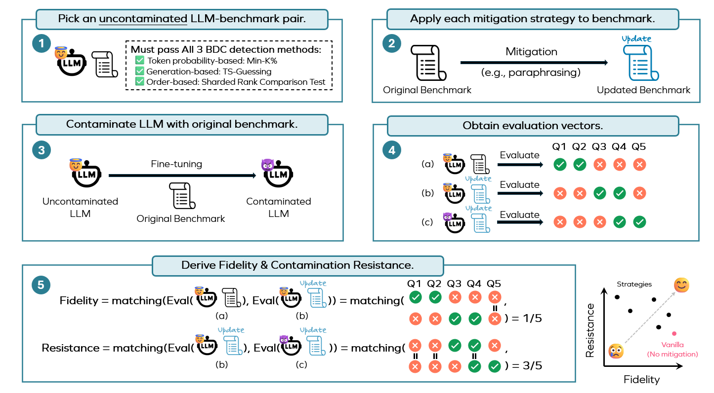

# A Rigorous Examination of Mitigation Strategies for LLM Benchmark Data Contamination

This repository contains the code necessary to assess benchmark data contamination (BDC) **mitigation** **strategies** based on the paper *The Emperor's New Clothes in Benchmarking? A Rigorous Examination of Mitigation Strategies for LLM Benchmark Data Contamination.*


We propose a systematic and controlled pipeline along with two novel metrics, fidelity and contamination resistance, to provide a fine-grained and
comprehensive assessment of BDC mitigation strategies.

## 🔄 Pipeline Overview

Our pipeline consists of the following steps:



### Step 1: Pick an uncontaminated LLM-benchmark pair.

We select an LLM-benchmark pair and ensure it passes three BDC detection methods to confirm it is uncontaminated, a crucial step for reliable "clean" evaluation results.

We utilize [LLMSanitize](https://github.com/ntunlp/LLMSanitize) to detect possible BDC. The implementation for this step is provided in `src/filtering/LLMSanitize`.

### Step 2: Apply each mitigation strategy to benchmark.

Each mitigation strategy is applied separately to the original benchmark to produce a updated benchmark; 20 strategies are examined in total in our paper. We employ GPT-4o to conduct all mitigation strategies. The implementation for this step is provided in `src/mitigation`.

### Step 3: Contaminate LLM with original benchmark.

The uncontaminated LLM is fine-tuned on the original benchmark dataset. Two contamination recipes (mild and intensive) are tested to ensure robust conclusions and three validation checks are performed to confirm the effectiveness of the contamination process. This part of code is based on [ConStat](https://github.com/eth-sri/ConStat). The implementation for this step is provided in `src/contamination`.

### **Step 4: Obtain evaluation vectors.**

Evaluation vectors are computed for: (a) uncontaminated LLM with the original benchmark, (b) uncontaminated LLM with the updated benchmark, and (c) contaminated LLM with the updated benchmark. The implementation for this step is provided in `src/evaluation`.

### **Step 5: Derive Fidelity & Contamination Resistance.**

Fidelity and resistance are derived based on the degree of matching between these evaluation vectors. An effective mitigation strategy should achieve high scores in both metrics.

## ⚙️ Installation

The library has been designed and tested with **Python 3.10** and  **CUDA 12.8**. First, ensure that **CUDA 12.8** is installed, then run the following commands:

```bash
conda create --name bdc python=3.10
conda activate bdc
pip install -r requirements.txt
```

## 💡 An Illustrative Example

We provide an example to demonstrate our assessment process. Suppose we aim to assess the BDC mitigation strategy **Typographical Perturbation**. We select the LLM-benchmark pair **meta-llama/Llama-3.1-8B** and **allenai/ai2_arc**.

The following code computes the **fidelity** and **contamination resistance** of this strategy.

### Step 1: Pick an uncontaminated LLM-benchmark pair.

We use the **[sharded likelihood test](https://arxiv.org/html/2310.17623)** to check whether **meta-llama/Llama-3.1-8B** is contaminated by **allenai/ai2_arc**. The following command runs the contamination check:

```bash
bash example/check_contamination.sh -m meta-llama/Llama-3.1-8B
```

The example output can be found in **`results/log_sharded-likelihood_allenai_ai2_arc_100.txt`**.

### Step 2: Apply each mitigation strategy to benchmark.

We provide two implementations for conducting the mitigation strategies:

+ OpenAI API

  Please replace "YOUR/OPENAI/API/KEY" in `./srv/mitigation/chat_utils.py` with your own OpenAI API key. Then, execute the following command to generate `typo.json` and `typo.csv` in the `./mitigated_datasets/arc_c`:

  ```sh
  python ./src/mitigation/mitigation_arc_c.py --mitigation typo
  python ./src/mitigation/formatting.py
  ```

  To apply additional mitigation strategies, run the following command:

  ```sh
  bash ./example/mitigated_query.sh
  python ./src/mitigation/formatting.py
  ```
+ OpenAI Batch API

  We also recommend using the OpenAI Batch API. To structure your project directory, follow the format below:

  ```sh
  BDC_Mitigation_Assessment/
  │── batch_queries/
  │   ├── arc_c/
  │── batch_responses/
  │   ├── arc_c/
  │── vanilla_datasets/ # Original datasets (not expanded) 
  │── mitigated_datasets/ # Updated datasets (not expanded)
  │── figures/ # Teaser (not expanded)
  │── example/ # Bash scripts (not expanded)
  │── src/ # Source code (not expanded)
  │── README.md
  │── requirements.txt
  │── .gitignore
  ```

  To generate a batch query file `typo.json` in `./batch_queries/arc_c`, run the following command:

  ```sh
  python ./src/mitigation/batch_api.py --dataset arc_c --mitigation typo
  ```

  To generate batch queries for additional mitigation strategies, run:

  ```sh
  bash ./example/mitigated_query_batch.sh
  ```

  Then, submit the batch query file to OpenAI and store the responses in `./batch_responses/arc_c`.
  After that, execute the following commands to get the updated benchmark:

  ```sh
  python ./src/mitigation/batch_parse.py
  python ./src/mitigation/formatting.py
  ```

### Step 3: Contaminate LLM with original benchmark.

Run this script to preprocess the benchmark data:

```sh
python src/contamination/preprocessing.py
```

Please set "BATH_PATH" (in preprocessing.py) as the path that you want to save the benchmark data and set "HF_CACHE_DIR" (in src/hparams.py) as the cache directory of your local huggingface models.

Run the following command to contaminate the model (finetuning it on original benchmark).   Note that we only provide an example which intensively contaminate Llama-3.1-8B on Arc-C, you may change the hyper-parameters to meet your own needs.

```sh
bash example/finetune.sh
```

### Step 4: Obtain evaluation vectors.

You can use the following codes to obtain evaluation vector:

```sh
CUDA_VISIBLE_DEVICES=0 python ./src/evaluation/eval_arc_c.py --mitigation vanilla --model_name meta-llama/Llama-3.1-8B
CUDA_VISIBLE_DEVICES=0 python ./src/evaluation/eval_arc_c.py --mitigation vanilla --model_name meta-llama/Llama-3.1-8B --conta
CUDA_VISIBLE_DEVICES=0 python ./src/evaluation/eval_arc_c.py --mitigation typo --model_name meta-llama/Llama-3.1-8B --conta
```

To obtain evaluation vectors of other mitigation strategies, replace `HF_HOME="YOUR/OWN/PATH"` in `./example/evaluation.sh` with your own huggingface path and run:

```sh
bash ./example/evaluation.sh arc_c 0 meta-llama/Llama-3.1-8B # Clean model evaluation 
bash ./example/evaluation.sh arc_c 0 meta-llama/Llama-3.1-8B true # Contaminated model evaluation
```

See `./example/evaluation.sh` for more details and options.

Alternatively, you can also use [lm-evaluation-harness](https://github.com/EleutherAI/lm-evaluation-harness) with moderate modifications.

### Step 5: Derive Fidelity & Contamination Resistance.

We compute the **fidelity** and **contamination resistance** metrics using the provided notebook **`calculate_metrics.ipynb`**.

# 🙏 Acknowledgement

Part of our codes is based on [LLMSanitize](https://github.com/ntunlp/LLMSanitize), [ConStat](https://github.com/eth-sri/ConStat) and [lm-evaluation-harness](https://github.com/EleutherAI/lm-evaluation-harness). We gratefully acknowledge their contributions.

# 📜 Citation

If you find our paper helpful, please kindly consider citing our paper in your publication.
